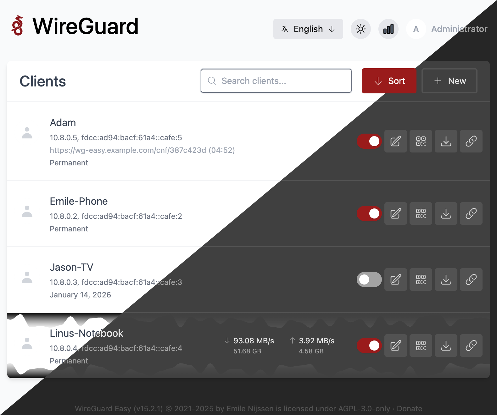

# wg-easy + Phobos obfuscator

[](https://github.com/Ground-Zerro/Phobos/actions/workflows/publish-image.yml)
[](https://github.com/Ground-Zerro/Phobos/stargazers)
[](LICENSE)

WireGuard admin panel with a built-in STUN obfuscator. Traffic from the client to the server is masked as STUN and XOR-encoded — to bypass DPI in regions with blocks.

<p align="center">
  
</p>

## Features

- WireGuard + Web UI + XOR/STUN obfuscator in a single container.
- s6-overlay supervises `node` and `wg-obfuscator` as independent long-running services.
- **Obfuscator presets**: run multiple independent obfuscator listeners side by side (different port/key/masking/idle/dummy), and pick one per client.
- Public WireGuard port is not exposed; only obfuscator UDP ports are published.
- Per-client **install-link**: one shell command installs a full Phobos package on the client (WG config + platform installer + multi-arch obfuscator binary).
- Admin UI for tuning presets, masking mode, keys, ports — per preset.
- SQLite + Drizzle, multilanguage UI, 2FA, per-client firewall, IPv6, CIDR support.

## Quickstart (generic Docker)

```yaml
name: phoboswg

volumes:
  phobos_etc_wireguard:
  phobos_sqlite_data:
  phobos_certs_data:

services:
  phobos:
    image: ghcr.io/ground-zerro/phobos:latest
    container_name: phobos
    ports:
      - "51822-51921:51822-51921/udp"
      - "51831:51831/tcp"
    volumes:
      - phobos_etc_wireguard:/etc/wireguard
      - phobos_sqlite_data:/app/server/data
      - phobos_certs_data:/app/certs
    cap_add:
      - NET_ADMIN
      - SYS_MODULE
    sysctls:
      - net.ipv4.ip_forward=1
      - net.ipv4.conf.all.src_valid_mark=1
    restart: unless-stopped
```

Open `http://<host>:51831`, complete the initial setup, create a client.

## One-command server deploy

Run one command on a fresh server:

```shell
curl -fsSL https://raw.githubusercontent.com/Ground-Zerro/Phobos/ph-wg-easy/deploy.sh | sudo bash
```

Script behavior:

- installs Docker + Compose plugin (if missing),
- downloads deployment files from this repository,
- pulls ready project image from `ghcr.io/ground-zerro/phobos`,
- starts the stack without server-side image build,
- opens the setup wizard: create admin account, set hostname, configure TLS.

After deployment open `http://<WG_HOST>:51831/` — the wizard guides through:
1. Admin account (username + password)
2. Server host (IP address or domain)
3. TLS certificate (self-signed / import existing / import by path / skip)

Optional parameters:

```shell
WG_HOST=<PUBLIC_IP_OR_DOMAIN> \
WG_EASY_IMAGE=ghcr.io/ground-zerro/phobos:latest \
curl -fsSL https://raw.githubusercontent.com/Ground-Zerro/Phobos/ph-wg-easy/deploy.sh | sudo bash
```

To skip the wizard and pre-configure admin credentials via environment:

```shell
INIT_ENABLED=true \
INIT_USERNAME=admin \
INIT_PASSWORD=YourPassword \
WG_HOST=<PUBLIC_IP_OR_DOMAIN> \
curl -fsSL https://raw.githubusercontent.com/Ground-Zerro/Phobos/ph-wg-easy/deploy.sh | sudo bash
```

Ports:

- Web UI: `http://<WG_HOST>:51831/`
- Obfuscator presets: `UDP <WG_HOST>:51822-51921` (one port per preset, allocated from this range)

## How it works

```
Client device                       Server (Docker)
─────────────                       ────────────────
 app ─► 127.0.0.1:13255              0.0.0.0:<preset.extPort>
        (local WG client)             (wg-obfuscator instance for this preset)
           │                             │  STUN unwrap + XOR decode
           │ plain WG                    ▼
           ▼                        127.0.0.1:51820 (wg0, loopback-only)
 127.0.0.1:13255                         │
 (wg-obfuscator client)                  │  WG
           │                             ▼
           │ XOR + STUN wrap        FORWARD → internet
           ▼
 UDP → <server_ip>:<preset.extPort>
```

A single `wg-obfuscator` process loads `/run/wg-obfuscator.conf`, where the server holds one `[preset-<id>]` section per active preset; the binary forks one listener per section. Each listener forwards decoded traffic to the same loopback WireGuard port — so the WG side stays unaware of the preset selection.

## Obfuscator presets

Presets let you serve different clients (or groups of clients) through obfuscator listeners with **independent parameters** on the same WG interface.

**What's in a preset**:
- `name` — free-form label shown in the admin UI;
- `extPort` — public UDP port the listener binds to, must be in `51822–51921` (the range docker-compose publishes by default);
- `key` — XOR key shared with this preset's clients only;
- `masking` — `STUN` / `AUTO` / `NONE`;
- `idle` — idle session timeout (seconds);
- `dummy` — max dummy bytes per packet;
- `clientWgLocalPort` — local WG port on the client side (matters when several Phobos profiles coexist on one router);
- `isDefault` — exactly one preset has this flag; it's used by every client that has no explicit assignment.

**Why use it**:
- Probe-resistant fallback: serve trusted users through `STUN` with light padding, hold a stricter `AUTO`-mode preset on a different port as backup.
- Per-group isolation: separate the key for a public test client from your personal profile so a leaked package can't decode the other.
- A/B different obfuscation parameters without restarting clients that don't move.

**Admin UI** — *Admin Panel → Obfuscator presets*:
- `Add preset` — Node picks the next free port in the range (or you supply one), generates a fresh key, applies the config and restarts the listener (single `s6-svc -r`).
- `Set as default` — moves the default flag in a single transaction; new and unassigned clients immediately use this preset.
- `Regenerate key` / `Regenerate port` — rotates the value and reapplies.
- `Delete` — only allowed for non-default presets; clients pointing at it fall back to default automatically (`ON DELETE SET NULL`).

**Per-client assignment**:
- *Create client* dialog has a preset dropdown; default option is **Use default preset**.
- *Edit client* page (`/clients/<id>`) has the same dropdown — switching it produces a new package download that targets the chosen preset's port/key.
- A non-default preset shows as a colored badge next to the client's name in the list.

**Lifecycle**:
- Each create/update/delete/regenerate/set-default action calls `Obfuscator.applyAll()`: it regenerates `/run/wg-obfuscator.conf` from the DB and issues `s6-svc -r /run/service/wg-obfuscator`. The single restart re-forks all listeners; existing sessions reconnect via `idle-timeout`.
- The run script starts the binary under `setsid` so all forked child listeners share a process group; `finish` follows up with `pkill -f /usr/local/bin/wg-obfuscator` to guarantee no zombie listeners survive a stop/restart.

## Client installation

1. Admin creates a client in the Web UI (optionally choosing a non-default obfuscator preset).
2. Admin clicks the **install-link** button — the command is copied to the clipboard:
   ```
   curl -sL http://<origin>/api/install/<token> | sh
   ```
3. Admin pastes the command on the target device. The script downloads the Phobos package, detects the platform, installs `wg-obfuscator` and configures WireGuard.

The downloaded WireGuard config carries the preset's parameters as an `[instance]` section appended to the standard `[Peer]` block, so the client obfuscator targets the right server port with the right key.

## Supported client platforms

- Keenetic / Netcraze (Entware + RCI API)
- OpenWrt / ImmortalWrt (opkg + UCI)
- Debian / Ubuntu Linux (apt + systemd)
- 3x-ui panels (SQLite integration)

## Remote deploy scripts

Additional helpers in `scripts/deploy/` are available for SSH-based remote operations and updates.

## Development

```shell
pnpm dev
```

## License

AGPL-3.0-only — see [LICENSE](LICENSE).

This project is not affiliated, associated, authorized, endorsed by, or in any way officially connected with Jason A. Donenfeld, ZX2C4 or Edge Security. "WireGuard" and the "WireGuard" logo are registered trademarks of Jason A. Donenfeld.
